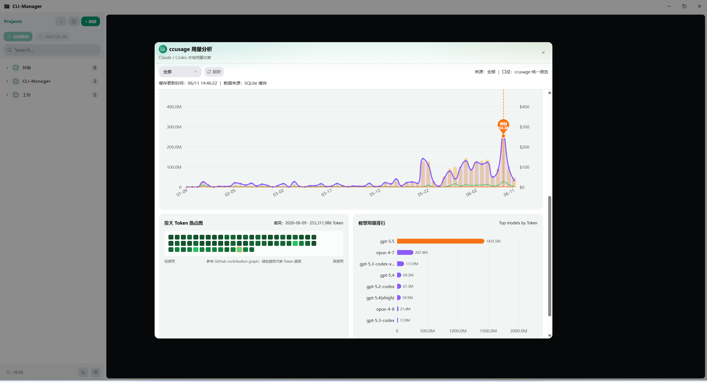
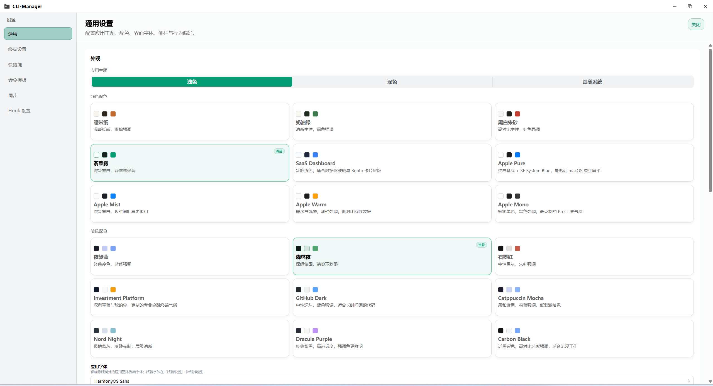

# CLI-Manager

> 🚀 面向 Windows 开发者的多项目 CLI 工作台

[](https://tauri.app/)
[](https://react.dev/)
[](https://www.rust-lang.org/)
[](https://www.typescriptlang.org/)

CLI-Manager 是一个基于 Tauri 构建的 Windows 桌面应用，用于统一管理多个开发项目的终端、命令模板与历史会话。

它提供多项目切换、命令复用、会话回看、Diff 查看和数据统计等能力，专为多项目并行开发场景设计。

---

## 📋 目录

- [项目概述](#-项目概述)
- [核心功能](#-核心功能)
- [界面预览](#-界面预览)
- [技术栈](#-技术栈)
- [快速开始](#-快速开始)
- [适用场景](#-适用场景)
- [Roadmap](#️-roadmap)
- [致谢](#-致谢)

---

## 💡 项目概述

CLI-Manager 聚焦 Windows 下多项目并行开发中的终端与会话管理问题：

- ❌ 终端窗口过多，切换成本高
- ❌ 常用命令重复输入，复用效率低
- ❌ 不同项目的 Shell、启动方式和环境变量配置分散
- ❌ Claude / Codex 等工具的历史会话缺少统一查看与追溯入口

**CLI-Manager 的目标是把"项目、终端、命令、会话、统计"集中到一个桌面工作台中。**

---

## ✨ 核心功能

### 🗂️ 项目与工作区管理

| 功能 | 说明 |
|------|------|
| **项目分组管理** | 支持多层级分组、拖拽排序、快速搜索 |
| **项目配置** | 为每个项目配置独立的路径、Shell 类型、启动命令、环境变量 |
| **路径健康检查** | 自动检测失效路径，快速识别配置问题 |
| **多工作区切换** | 在项目间快速切换，保持上下文隔离 |

### 💻 终端与会话操作

| 功能 | 说明 |
|------|------|
| **应用内嵌终端** | 基于 xterm.js，支持 Tab 管理与拖拽排序 |
| **分屏支持** | 单个 Tab 内支持水平 / 垂直分屏 |
| **会话恢复** | 刷新后自动重建运行中的终端会话 |
| **外部终端模式** | 通过 Windows Terminal 在一个窗口内打开多个 Tab |
| **多 Shell 支持** | PowerShell、CMD、Pwsh、WSL、Bash 等 |
| **终端背景自定义** | 支持自定义背景图片、透明度、适配模式、高斯模糊与暗化覆盖 |

### ⚡ 命令模板与快捷操作

| 功能 | 说明 |
|------|------|
| **命令面板** | `Ctrl+P` 打开全局命令面板，快速执行项目与命令 |
| **三级模板作用域** | 支持全局 / 项目 / 会话级命令模板 |
| **命令历史** | 自动记录命令历史，支持搜索与一键重放 |
| **快捷键自定义** | 新建终端、切换标签、命令面板等快捷键可自定义 |
| **Prompt Library** | 内置提示词库，快速复用常用 AI 提示模板 |

### 📜 历史会话与 Diff 回看

| 功能 | 说明 |
|------|------|
| **统一会话视图** | 查看 Claude / Codex 历史会话 |
| **智能筛选** | 支持来源筛选、全局搜索、会话内搜索 |
| **时间分组** | 按 Today / Yesterday / This Week / This Month / Earlier 分组浏览 |
| **Diff 查看** | 支持 Unified Diff 与 Codex Patch 风格，可跳回触发消息 |
| **代码块高亮** | 行级高亮（新增/删除/hunk/header） |

### 📊 分析看板与统计洞察

| 功能 | 说明 |
|------|------|
| **会话统计** | 会话数、消息数、输入 / 输出 Token 统计 |
| **项目排行** | 可交互的项目活跃度排行（点击即按项目过滤） |
| **模型占比** | 模型使用构成图（前 5 + 其他） |
| **Token 趋势** | 会话 / 消息趋势图与 Token 构成图，支持 hover 详情与日期下钻联动 |
| **活跃热力图** | 支持 7 / 30 / 90 天范围，点击日期展开当日会话并跳转 |
| **来源对比** | 来源分布对比图 |
| **效率散点** | 项目效率散点图 |
| **时段分布** | 24 小时活跃时段分布图 |

### ⚙️ 同步与个性化设置

| 功能 | 说明 |
|------|------|
| **WebDAV 云同步** | 同步项目、分组、模板与设置到云端 |
| **终端主题** | 多种内置主题与自定义能力 |
| **紧凑模式** | 支持紧凑模式与字体大小调整 |
| **快捷键配置** | 集中配置所有快捷键 |
| **设置中心** | 统一管理所有配置项 |

---

## 📸 界面预览

### 主界面总览


### 历史会话工作区


### 分析看板


### 设置与同步界面


---

## 🛠️ 技术栈

### 前端
- **框架**: React 19 + TypeScript
- **构建工具**: Vite 7
- **状态管理**: Zustand
- **样式**: Tailwind CSS 4
- **终端**: xterm.js + FitAddon + WebglAddon
- **UI 组件**: Radix UI, Mantine Core
- **图表**: ECharts
- **拖拽**: @dnd-kit
- **Diff 展示**: react-diff-view

### 后端
- **运行时**: Tauri 2.x
- **语言**: Rust
- **数据库**: SQLite (tauri-plugin-sql)
- **存储**: tauri-plugin-store
- **PTY**: Rust PTY 会话管理
- **云同步**: WebDAV 适配层

### 关键能力
- 多 Shell 支持 (PowerShell / CMD / Pwsh / WSL / Bash)
- PTY 会话管理与状态广播
- 历史解析 (Claude / Codex 会话与 Diff)
- WebDAV 云同步与冲突处理
- 跨平台桌面打包

---

## 🚀 快速开始

### 方式一：下载可执行版本

前往 [Releases](https://github.com/yourusername/CLI-Manager/releases) 页面获取最新版本，根据环境选择对应构建产物。

### 方式二：从源码运行

#### 前置要求
- Node.js >= 18
- Rust >= 1.70
- Windows 10/11

#### 安装依赖
```bash
npm install
```

#### 开发运行
```bash
npm run tauri dev
```

#### 构建发行版本
```bash
npm run tauri build
```

#### 其他常用命令
```bash
# TypeScript 类型检查
npx tsc --noEmit

# Rust 检查
cd src-tauri && cargo check

# Rust 测试
cd src-tauri && cargo test
```

---

## 🎯 适用场景

- ✅ 同时维护多个本地项目、需要频繁切换终端的开发者
- ✅ 在 Windows 上统一管理不同 Shell 与启动方式的项目用户
- ✅ 经常复用命令模板、依赖命令面板提升效率的用户
- ✅ 需要回看 Claude / Codex 历史会话、Diff 与统计数据的高频使用者
- ✅ 需要跨设备同步开发配置的用户

---

## 🗺️ Roadmap

### 计划中的功能

#### CC-Switch 集成
- 读取与展示 CC-Switch 配置
- 支持供应商切换
- 与同步能力整合

#### Claude 配置同步增强
- 同步 Claude Code 配置
- 纳入 Claude 相关配置与扩展能力同步
- 为多工具协作预留接口

---

## 🎉 致谢

本项目在 [LINUX DO](https://linux.do/) 社区推广，感谢 LINUX DO 社区对开源项目的支持与认可。

---

## 📄 许可证

请参阅仓库中的 LICENSE 文件。

---

**⭐ 如果这个项目对你有帮助，欢迎 Star 支持！**
